Design Specification
===

Problem
---

Due to the pandemic and social distancing measures, we now live a good part of our lives virtually. For some, this may seem like a dream come true, but for students in grade school this is a major disruption in their lives. Before the pandemic, schools used to manage students’ routines through scheduled period bells and having students physically move to their next classroom. But with the transition to online classes, they lose this scheduled routine. 

Now more than ever, it’s important for students to keep a schedule of their routines throughout their days because it’s very easy to get sidetracked and lose incentive for school without one. Research shows that routines and schedules are important for young students because it helps them feel comfortable and safe knowing what’s next in their day. It can also have benefits in reduced anxiety and an increase in positive well-being and cognitive function. 

As important as it is to keep a schedule, it is also important to motivate students to engage in time management. Through research it has been shown that time management is a universal problem. Children develop their time management skills at a different pace. And for many, time management is still a trouble after adulthood. So how can we motivate students to engage and practice in time management at an early age?  

***

Solution
---

We envision an electronic calendar as our solution in which children are able to input their future plans, and then tracking them over time. We chose Gerbil as our theme animal to help engage young users. Moreover, we are planning on building a reward system to help young children continuously practice their time management by using our website.

We will focus on the calendar itself and the reward system as our Minimum Viable Product. If we have time at the end, we will implement to-do lists and future plans as add on functions. 

***

**HOME PAGE**

The home page is a static page. In this page, we introduce Gerbil using short stories to build connections between our users and our theme. We included a graphic illustration of gerbil to set up a kid-friendly environment.  On the top, there is a nav bar which allow user to either "Log-in" to our system  or directly engage in creating their schedules by clicking "Tell Gerbil Your Upcoming Plans".

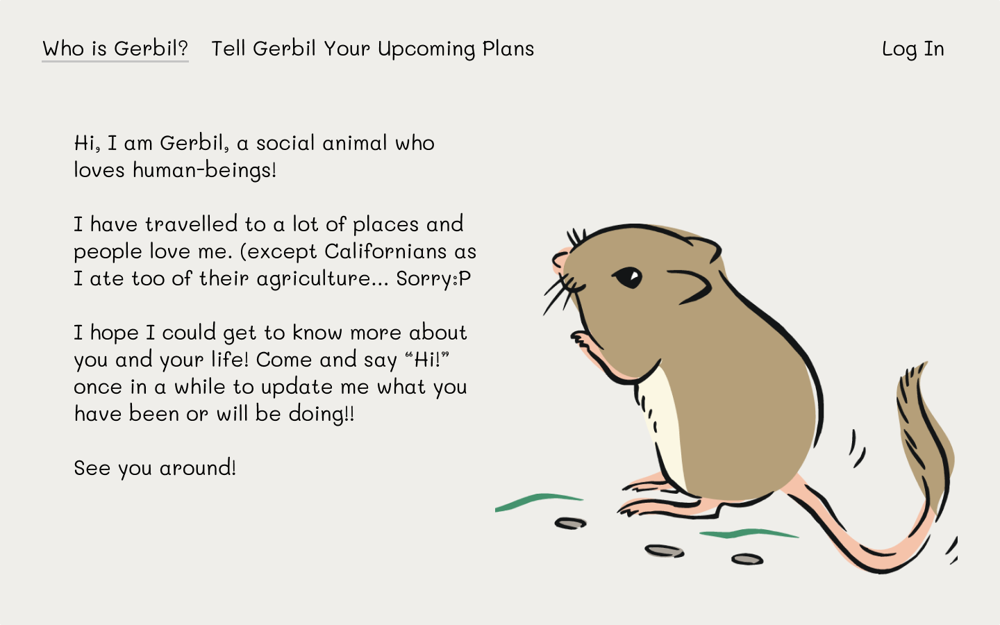

By clicking "Tell Gerbil Your Upcoming Plans", users can now design their calendars. Users could input their name, how they want to name their upcoming weeks, as well as their designated planned time. After hitting “Let’s schedule together”, we bring them to the calendar page.

***

**Calendar**

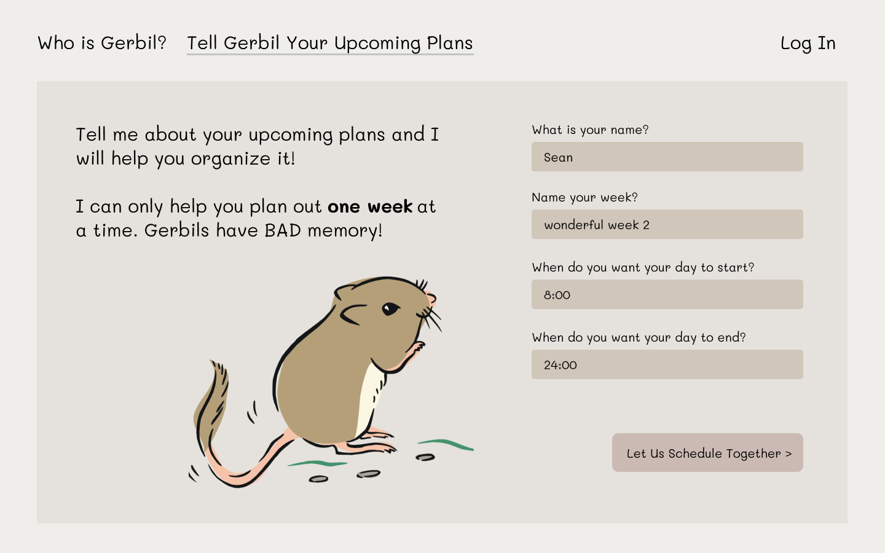

The calendar page has three primary interaction buttons - “Add a schedule” “Add a note”, and “Print”. "Add a schedule" allows the users to input their upcoming schedules. "Print" allows the users to quickly export an image or pdf so that they can print it out. "Add a note" allows users to put in their upcoming plans or any notes they want to keep for the future.

More detailed interactions will be shown in the next few prototypes.

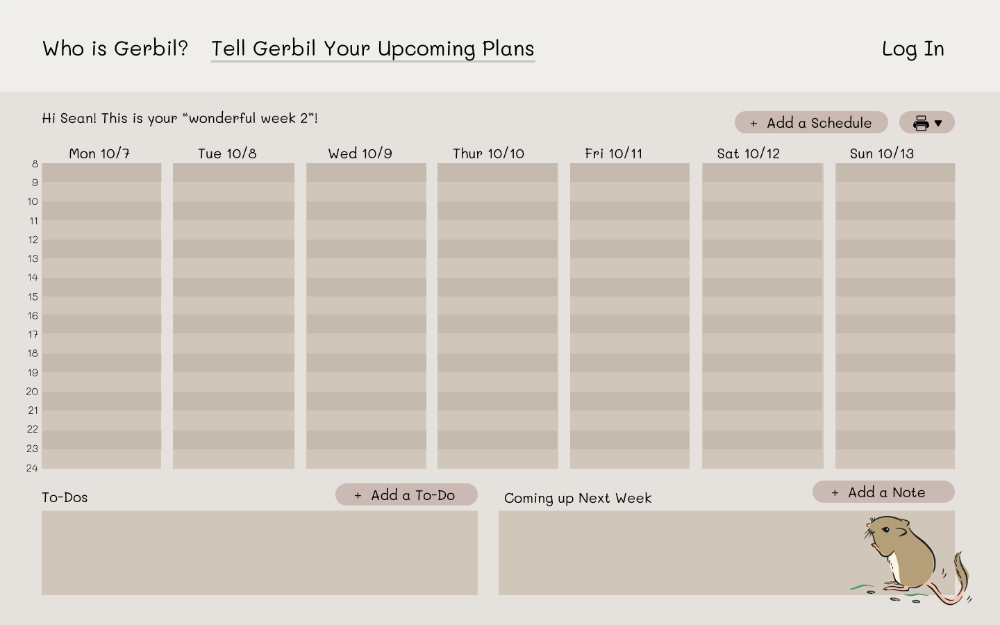

By clicking on "Add a schedule", it opens a pop-up modal. Users could input details of the events here. By choosing repeated events, users can create the event in multiple days. After clicking on the add to schedule, the event will be added. By clicking on the cancel button or “X” button on the top right corner, the modal will be closed (content will not be saved).

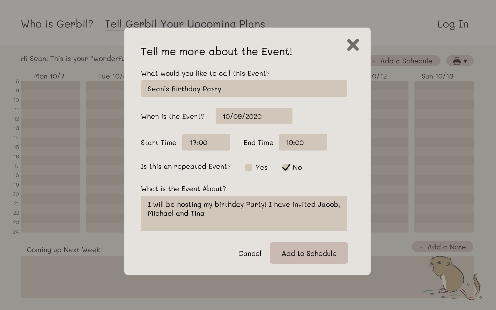

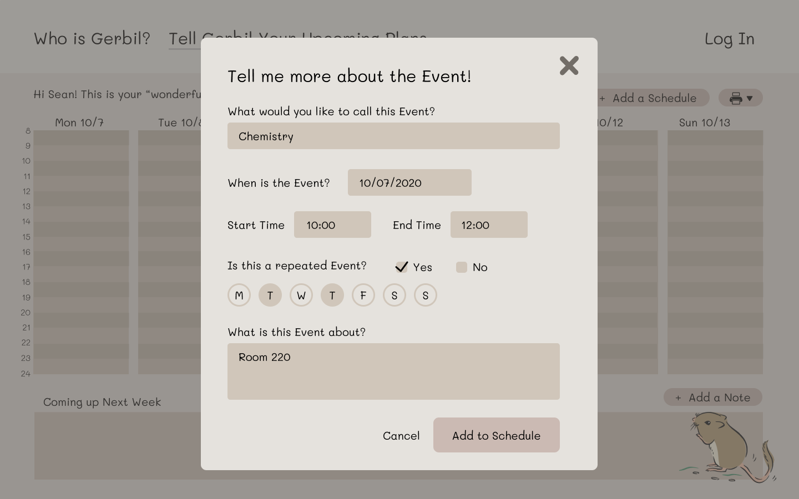

.png)

By clicking on "Add a note", it opens a pop-up modal. User could note down any upcoming plans. We left date as an optional.

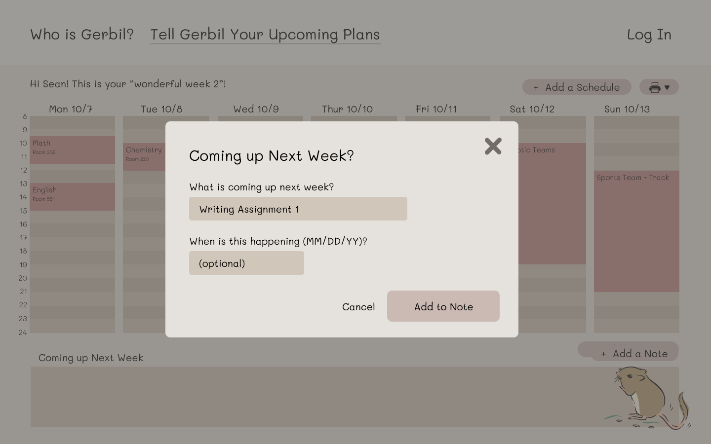

The following prototype shows an example of what it would look like if one has planned out their weeks. 

.png)

To print out their schedule, users will simply click on the top right "print" button and then export the calendar as either pdf or jpg.

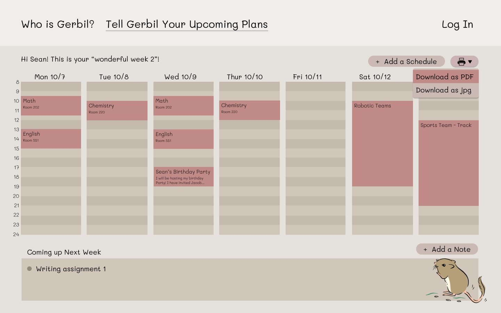

Before they print it out. We ask them if they want their parents add them a note. 

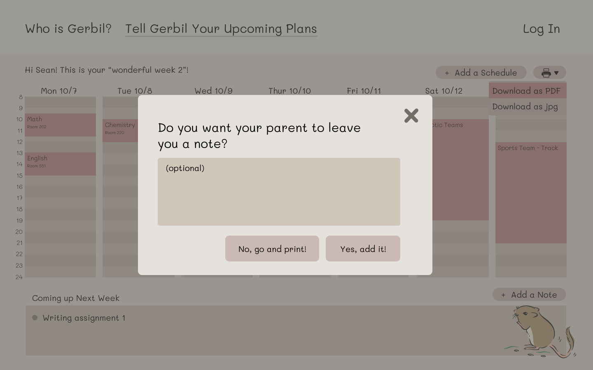

We will put their note onto their calendar to enourage them. Now they can print it out! (Preview of the page is below)

.png)

If they choose to not put a note, it will instead to be Gerbil's note. We will autogenerate them a encourage note to help them more engaged in the week. (Preview of the page is below)

.png)

Confirm modal will show up when download is triggered.
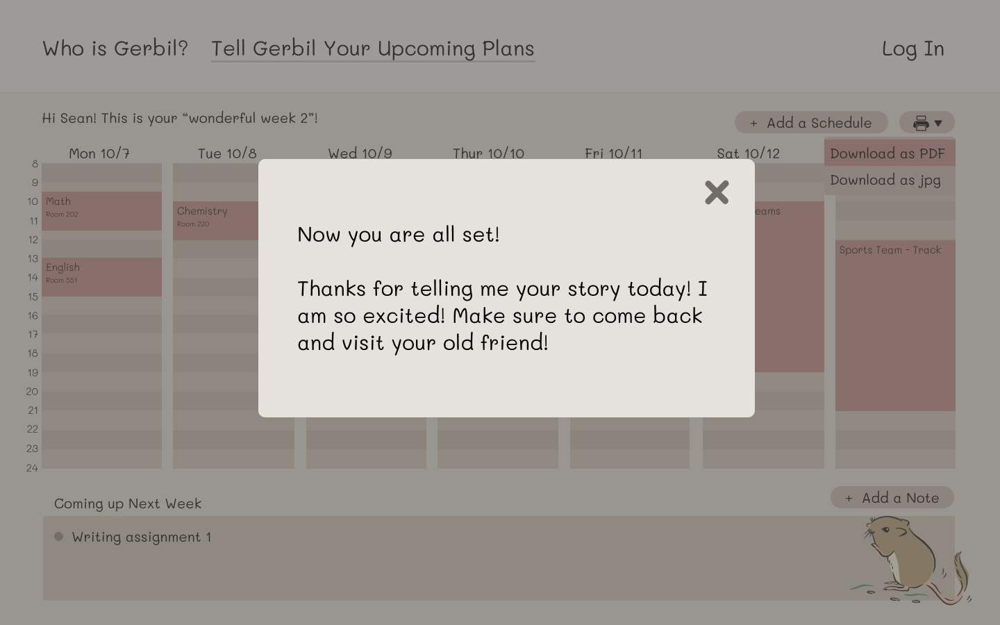

***

**Sign up/Log In**

If user choose to sign up with our system, that means they want to be friends with Gerbil. Now Gerbil will remeber their name permanently. After sign up, users could log in to save their calendar data and update schedules at any time they want. 

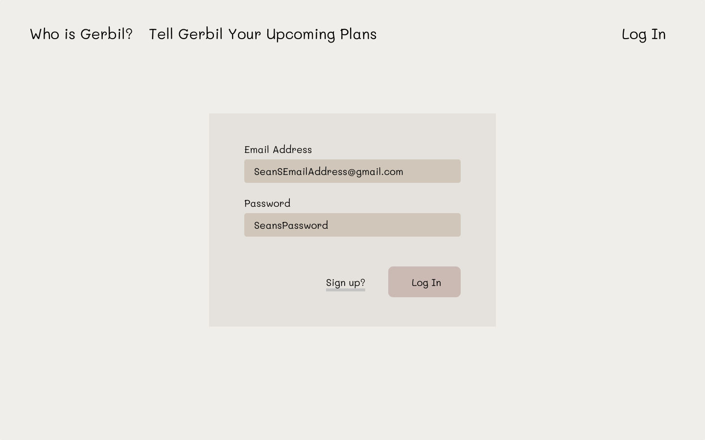

***

**Reward System**

User will auto-enroll in our postcard collection system after they sign up. By clicking on top right profile avatar and select gift gallery, they can enter the gallery and view gifts they have earned from Gerbil.

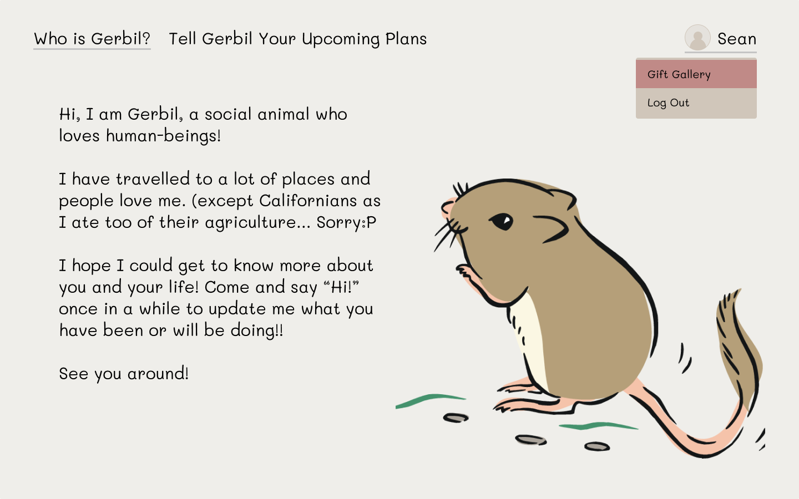

For some of the gifts, we allow users to see the conditions so that they have incentive to earn them through cotinuous engagement. For some of the other gifts, we make the earning condition to be secret to add more fun. 

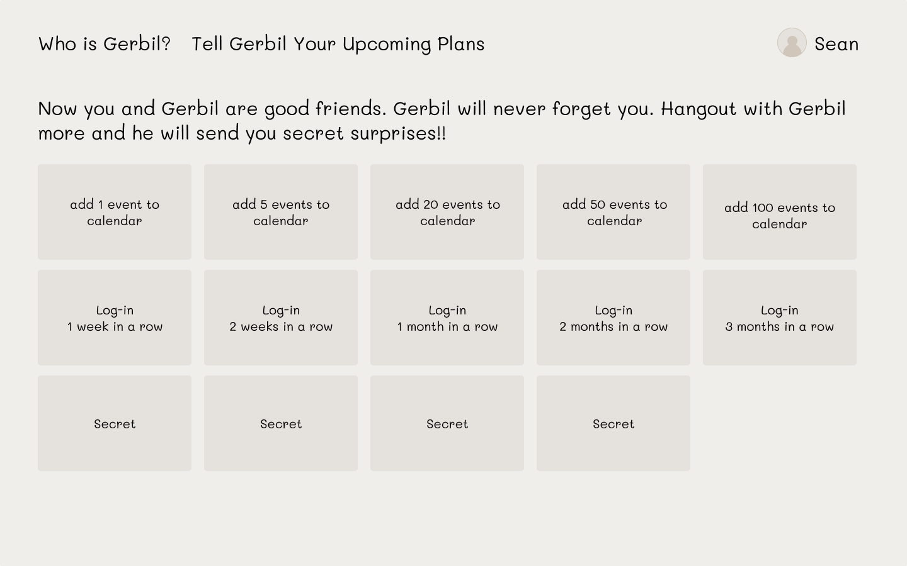

For example, if a user achieved one of the task, a modal would pop up to inform them about their earned gift.

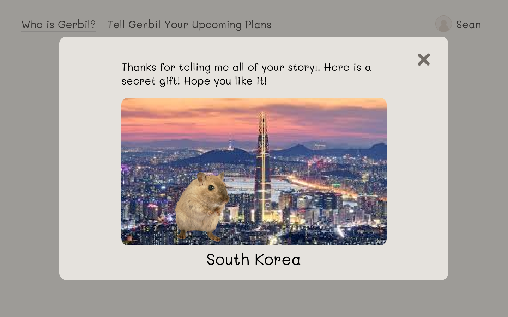

Then, they will be able to see it from the collection.

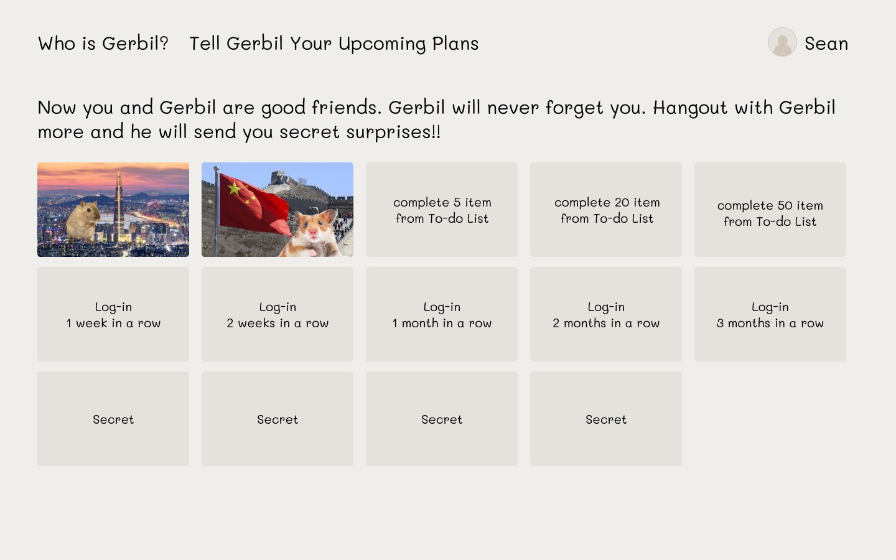