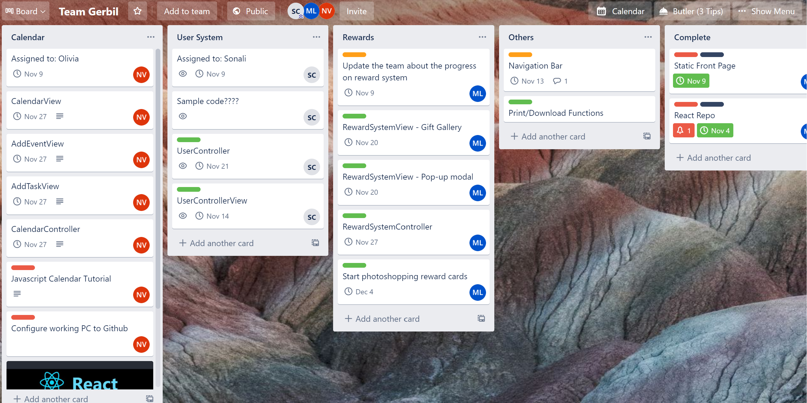

Plan
===
How will you coordinate your work?
---
Who will coordinate the work?
- Sonali Chandra

What will their project management practices be?
- Use Trello Board to keep track of the progress.
- PM is responsible for keeping track of work assigned to each member, and remind them of internal due dates
- All members in the team are responsible for writing down progress of their learning on the Trello board. PM can then use the Trello board to keep track and update what each member is working on
- PM can assign tasks to each member

Will you have meetings? How frequently? Who plans their agendas?
- Yes
- Fixed meeting time: **Friday 6pm - 9pm**
- Extra meeting time: Generally during *weekends*. Times vary depending on members’ working schedules, but at least once a week. More meetings will take place if necessary

Written justification: 
---

What tools will you use to communicate?
- Discord
- As an alternative, when someone can’t be reached through discord: email to notify them.
- Text as another alternative

For all of the requirements, how will your verifications be integrated into your process? Will you run automated tests after every build? Before every commit? When will you conduct inspections and who will be involved?

- Our verifications will be integrated into our process by (whenever possible) testing out each feature when it and all other associated features are complete. We will run each test again at the entire program’s completion to ensure everything is functional and works as specified.
- We will run tests before every commit to ensure that we don’t introduce new- not all may be automated, and our tests should be easy to do manually.
- We will conduct inspections when the program is largely complete, to be able to as much as possible. Dev will mainly be responsible for inspections, but designer and PM may be involved as well if necessary.

Who will own components in your architecture?
Owning them means being responsible for writing them and making sure they are functional and correct.

**Responsibility by person:**

- Firebase Model - Everyone
- CalendarView - Olivia
- CalendarController - Olivia
- AddEventView - Olivia
- AddTaskView- Olivia
- RewardSystemView - Mengjiao
- RewardSystemController - Mengjiao
- UserController - Sonali
- UserControllerView- Sonali 

What is your timeline?
---

- **11/04/2020**
    * Create React Repo
- **11/09/2020**
    * Static Front Page
    * Update team members about the progress on their responsible parts
- **11/13/2020**
    * Navigation Bar
- **11/14/2020**
    * UserControllerView
- **11/20/2020**
    * RewardSystemView - Gift Gallery
    * RewardSystemView - Pop-up modal
    * Calendarview, AddEventView, TaskView, CalendarController (Should at least be halfway-mostly complete)
- **11/21/2020**
    * UserController
- **11/27/2020**
    * RewardSystemController
    * Review UserControllerView, CalendarView, AddEventView, TaskView, CalendarController (Must be 100% complete)
- **11/30/2020**
    * Finish photoshopping all reward cards
    * Start merging code
    

How will you verify that you've met your requirements?
---

### User System

- **RQ - US - 1:** Users must be able to sign up
   * This requirement is an interaction design requirement
   * This can be tested by passing a name, email, and password into the sign up function, and checking whether the subsequent credentials show up in the database.
   * Interaction steps:
       * User clicks on “Sign up” in the log in page
       * User input their email address and password
       * User clicks on “Sign up” button
       * Page refreshes
       * In the database, the user’s name, email address, and password should show up
   * Extra Tests:
       * Name input box
           * Includes only letters, numbers, certain special characters(.)
           * Maximum 20 characters
       * Email input box
           * Includes letters and numbers
           * Includes one “@” symbol
           * Includes “.com, .edu, .org”
           * No other symbols allowed
           * Maximum 50 characters
           * Email should not already be in the database.
           * If the user entered an email that already exists in the database, we will warn them that the email address already exists and direct them to log in instead
       * Password input box
           * Includes only letters, numbers, certain special characters(!@#$%^()&*)
           * Longer than 6 characters
           * Maximum 20 characters
       * User cannot sign up if name input box is left empty
       * User cannot sign up if email input box is left empty
       * User cannot sign up if password input box is left empty
       
- **RQ - US - 2:** Users must be able to log in to the site
   * This requirement is an interaction design requirement
   * This requirement is going to be tested after RQ-US-1 has passed.
   * Interaction steps:
       * User clicks on the “Log In” button on the top right of the screen
       * User inputs their email address and password
       * User clicks on “Log In” button
       * Page refreshes, and they can see their calendar (including data if they previously entered any)
   * Extra Tests:
       * Email input box
           * Includes letters and numbers
           * Includes one “@” symbol
           * Includes “.com, .edu, .org”
           * No other symbols allowed
           * Email should be in the database.
           * If user entered email that is not exist in the database, we will warn them that the email address is not exist, direct them to sign up
       * Password input box
           * Make sure it only includes letters, numbers, certain special characters(!@#$%^()&*)
           * Longer than 6 characters
           * Maximum 20 characters
       * User cannot log in if email input box is left empty
       * User cannot log in if password input box is left empty
       
- **RQ - US - 3:** Users must be able to log out of the system.
   * This requirement is an interaction design requirement
   * This requirement can be tested after RQ-US-2(User log in) is validated.
   * Interaction steps:
       * User clicks on the “Log Out” button on the top right of the screen
       * Page refreshes, and the user can be taken back to the home page (Tell Gerbil a Story page)
       * Calendar page should not show user’s current schedule anymore

### Calendar

- **RQ - C - 1:** Users must be able to adjust calendar settings
   * This requirement is an interaction design requirement
   * This requirement can be tested after RQ-US-2 has tested
   * Interaction steps:
       * (User must be logged in already)
       * Users must be able to modify the following calendar settings: a title/description of their current week, calendar’s time preference, and calendar day’s time range, stating start time and end time for day time, and choosing between a 12hr/24hr time schedule. 
       * After user chooses and confirms changed settings, page refreshes, and new changes to settings are shown
   * Extra tests:
       * The title/description of their current week (input box)
           * Make sure it supports all characters, including special characters and emojis)
           * Maximum 50 characters 
       * The calendar’s time preference (radio button)
           * Users can select “24hr time system”
           * Users can select “12 hr(AM/PM) time system”
           * User must select one of the option, meaning they will not be able to deselect both or select both at the same time
       * Start time (dropdowns)
           * Users can only select options from the dropdown
       * End time (dropdowns)
           * Users can only select options from the dropdown
           
- **RQ - C - 2:** Users must be able to create an event(s)
   * This requirement is an interaction design requirement
   * This requirement can be tested after RQ-US-2 has tested
   * Interaction steps:
       * (User must be logged in already)
       * User clicks on “Create New Event” button
       * View should change to the New Event modal
       * Users must be able to modify the following event: the tite, the date, if the event is a one time event, the start time, the end time, and description of the event.
       * Once user confirms creation, the event must be stored in the database
       * Calendar refreshes to show created event
   * Extra tests:
       * The title (input box)
           * Make sure it supports all characters, including special characters and emojis)
           * Maximum 50 characters
       * The date (dropdowns)
           * Users can only select options from the dropdown
       * All-day event (check box)
           * If the user checks the box, we will not display the start time and end time’s input box
           * If the user did not check the box, we will include an input box for start time of the event and an input box for end time of the event
       * Start time (dropdowns)
           * Users can only select options from the dropdown
       * End time (dropdowns)
           * Users can only select options from the dropdown
       * The description (input box)
           * Make sure it supports all characters, including special characters and emojis)
           * Maximum 100 characters
       * Users are not allowed to create an event if the title is left blank.
       * Users are not allowed to create an event if the date is left blank.
       * Users are not allowed to create an event if they uncheck the all-day event and did not input start time
       * Users are not allowed to create an event if they uncheck the all-day event and did not input end time
- **RQ - C - 3:** Users must be able to delete created events
       * This requirement is an interaction design requirement
       * This requirement can be tested after RQ-US-2 and RQ-C-2 has been tested
   * Interaction steps:
       * (User must be logged in already)
       * User right clicks on existed events
       * User selects dropdown menu next to the event, and selects “delete event”
       * Popup window appears. User confirm if they want to delete event
       * Calendar refreshes and event is removed

- **RQ - C - 4:** Users must be able to cancel creating an event if the event is still pending creation
   * This requirement is an interaction design requirement
   * This requirement can be tested after RQ-US-2 has been tested
   * Interaction steps:
       * (User must be logged in already)
       * (User must be on “Create an Event” modal already)
       * User clicks the cancel or x  button on the modal
       * User exits the “Create an Event” modal
       * User should not be able to see the cancelled event on their calendar
    * Extra Tests:
       * Event information should not show up in the database
       
- **RQ - C - 5:** Created events must be visible on the calendar once the user adds the event onto the calendar
   * This requirement is an interaction design requirement
   * This requirement can be tested after RQ-C-2 has tested
   * Interaction steps:
       * (User must be logged in already)
       * After user creates an event: calendar must refresh to show new events, and display already created events
       * Events must not disappear unless a user cancels event, or starts new calendar week
   * Extra tests:
       * Trying to create events exceeding calendar week’s max capacity of events
       * Trying to create an event that conflicts with another event’s time, on the same day
       * Deleting an event that takes place on the same day as a newly added event
       * Performing and confirming any action that would require the calendar page to update itself and refresh existing events

- **RQ - C - 6:** If, during event creation, the user doesn’t fill out all required fields when making an event, the user will be prevented from creating the event
   * This requirement is an interaction design requirement
   * This requirement can be tested after RQ-US-2 has tested
   * Interaction Steps:
       * (User must be logged in already)
       * User clicks on “Create New Event” button
       * View should change to the New Event modal
       * User doesn’t fill out necessary fields required for event creation
       * Popup window appears, telling user cannot create event until specific fields have been filled

### Print/Download Function

- **RQ - PD - 1:** The user must be able to print the current week view from any compatible printer.
   * This requirement is an interaction design requirement
   * This requirement can be tested after RQ-US-2 has been tested
   * Interaction steps:
       * (User must be logged in already)
       * User must select Print button, on top right corner of calendar interface
       * User must be able to view and select printing options such as printer to use, page size, number of pages to print, on popup window, etc
       * User selects “print” button
       * Designated printer successfully prints out page according to user’s specifications
       
- **RQ - PD - 2:** The user should be able to download a file of the current week view as a .pdf
   * This requirement is an interaction design requirement
   * This requirement can be tested after RQ-US-2 has been tested
   * Interaction steps:
       * (User must be logged in already)
       * User must select Print button, on top right corner of calendar interface
       * User must select either “Download as PDF” or “Download as .jpg”
       * Popup window appears, and user must select where to save file
       * Downloaded file must appear in designated location
       
- **RQ - PD - 3:** The user should be able to download a file of the current week view as a .jpg
   * This requirement is an interaction design requirement
   * This requirement can be tested after RQ-US-2 has been tested
   * Interaction steps:
       * (User must be logged in already)
       * User must select Print button, on top right corner of calendar interface
       * User must select either “Download as PDF” or “Download as .jpg”
       * Popup window appears, and user must select where to save file
       * Downloaded file must appear in designated location
       
- **RQ - PD - 4:** Before print/download the current week calendar, the user should be able to select whether they want to add a note
   * This requirement is an interaction design requirement
   * Interaction steps:
       * When user clicks on “Print” or “Download”, popup window prompts user to add note
       * User adds note
      * Note appears on calendar
       * Depending on  option selected, user is taken to Print or Download popup and continues to print/download like normal
       
### Reward System 

- **RQ - RS - 1:** After logged in, users must be able to access gift gallery from the top nav
   * This requirement is an interaction design requirement
   * This requirement can be tested after RQ-US-2 has been tested
   * Interaction steps:
       * (User must be logged in already)
       * Users click on the avatar on the top right corner
       * Users click on the gift gallery under the dropdown
       * Users enters gift gallery

- **RQ - RS - 2:** Users must be able to see received awarded item through gift gallery
   * This requirement is an interaction design requirement
   * This requirement can be tested after RQ-US-2 has been tested
   * Interaction steps:
       * (Users must be logged in already)
       * (Users should already be in the gift gallery)
       * Users should be able to see all the received awarded item 
       
- **RQ - RS - 3:** Users must be able to see the requirements for some of the obtaining award items
   * This requirement is an interaction design requirement
   * This requirement can be tested after RQ-US-2 has been tested
   * Interaction steps:
       * (Users must be logged in already)
       * (Users should already be in the gift gallery)
       * Users should be able to see all the requirements for some of the obtaining award items 
       
- **RQ - RS - 4:** Users must not be able to see the requirements for obtaining award items that we choose to keep earning condition as secret.
   * This requirement is an interaction design requirement
   * This requirement can be tested after RQ-US-2 has been tested
   * Interaction steps:
       * (Users must be logged in already)
       * (Users should already be in the gift gallery)
       * Users should not be able to see requirements for obtaining award items that we choose to keep earning condition as secret
       
- **RQ - RS - 5:** Users must not be able to access rewards until requirements have been met
   * This requirement is an interaction design requirement
   * This requirement can be tested after RQ-US-2 has been tested
   * Interaction Steps:
       * (Users must be logged in already)
       * (Users should already be in the gift gallery)
       * Users must not be able to access rewards until requirements have been met
       
- **RQ - RS -7:** Users must be able to access reward if they have unlocked respective requirement
   * This requirement is an interaction design requirement
   * This requirement can be tested after RQ-US-2 has been tested
   * Interaction Steps:
       * (Users must be logged in already)
       * (Users should already be in the gift gallery)
       * User sees locked grey image with requirement on it
       * User leaves reward page, and completes necessary requirement
       * User returns to reward page
       * Image with completed requirement will display “Completed Requirement” (or similar message)
       * When user clicks on the image, “Completed Requirement” image disappears, and full reward  image is unlocked
